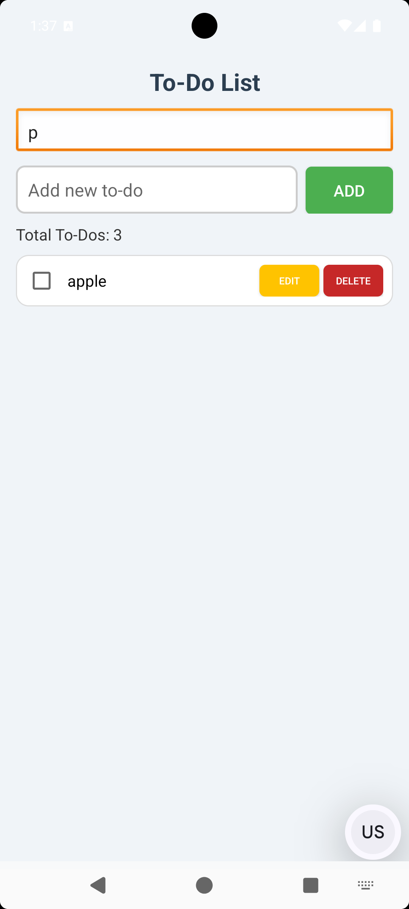
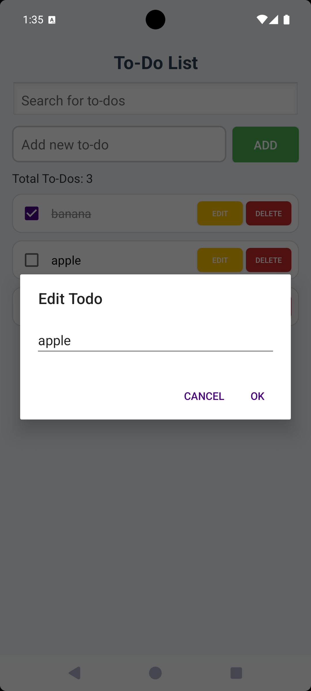

# ✅ To-Do List Android App

A clean, intuitive, and fully functional to-do list application for Android that helps you organize your tasks efficiently — **no ads, no subscriptions**.

---

## ✨ Features

- 📝 **Create Tasks** – Add new to-do items with a simple and fast interface  
- 🔍 **Search Functionality** – Quickly find specific tasks by keyword  
- ✅ **Mark as Complete** – Visually strike through completed tasks (greyed-out text with checkbox)  
- ✏️ **Edit Tasks** – Modify any existing task with a dedicated "Edit" button  
- 🗑️ **Delete Tasks** – Remove tasks with a red "Delete" button  
- 🔄 **Data Persistence** – All tasks are stored locally using `SharedPreferences` and persist across app sessions  
- 📊 **Task Counter** – Displays the total number of current tasks in real-time  
- 🎨 **Clean UI** – Material-inspired layout with color-coded buttons using custom drawables  
- ♿ **Accessibility-Friendly** – Proper color contrast, descriptive labels, and touch target considerations

---

## 📱 Screenshots

> Place your actual app screenshots in a `screenshots/` folder and update paths accordingly

| Main Screen | Search Task | Edit Task |
|-------------|-------------|-----------|
|  |  |  |

---

## 🚀 Installation

1. Clone this repository:
   ```bash
   git clone https://github.com/your-username/To-Do-List-App.git
   ```

2. Open the project in **Android Studio**.

3. Build and run the app on an Android emulator or real device running Android 5.0 (API 21) or higher.

---

## 📂 Project Structure

```
com.example.to_do/
├── MainActivity.java              # Main screen logic and UI
├── SharedPreferencesManager.java # Handles task saving/loading
├── TodoAdapter.java              # RecyclerView adapter for task display
├── TodoItem.java                 # Model class representing a to-do task

res/
├── layout/
│   ├── activity_main.xml         # Main screen layout with input, search, and list
│   └── todo_item.xml             # Layout for each task item with edit/delete buttons
│
├── drawable/
│   ├── button_add_bg.xml         # Green background for Add button
│   ├── button_edit_bg.xml        # Orange background for Edit button
│   ├── button_delete_bg.xml      # Red background for Delete button
│   ├── edittext_bg.xml           # Rounded background for input fields
│   └── todo_item_bg.xml          # Background for task item rows
```

---

## 🛠️ Built With

- **Java**
- **Android Studio**
- **RecyclerView**
- **SharedPreferences**
- **Custom Drawable Resources (XML)**

---

## 📌 Upcoming Improvements

- 🗓️ Add due dates and reminders  
- 🔔 Task notification support  
- ☁️ Cloud sync with Firebase  
- 🌓 Dark mode  
- 🧹 Swipe to delete, drag and reorder tasks  
- 🧠 Add categories or tags for better task organization

---

## 📄 License

This project is open-source and free to use under the [MIT License](LICENSE).

---

## 🙋‍♀️ Author

Developed with ❤️ by **Basma**  
For questions or suggestions, reach out via **basmaalhusayni@gmail.com** or open an issue.

